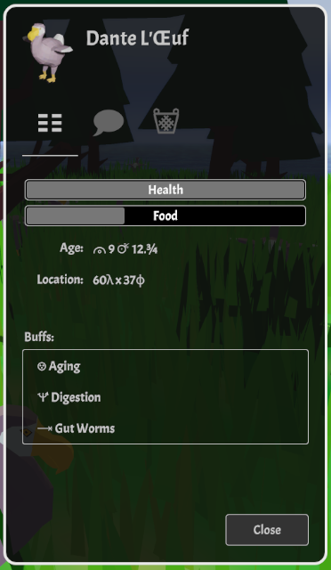
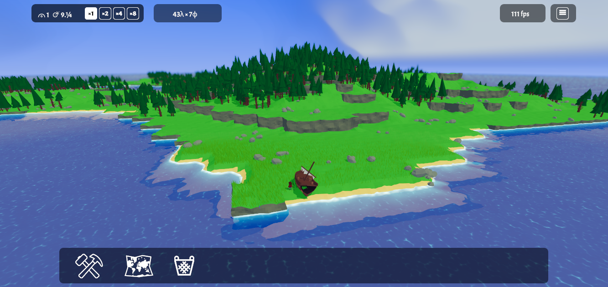
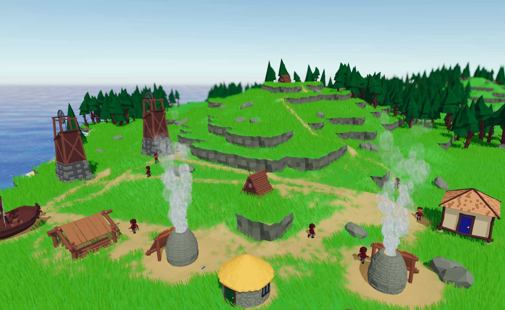
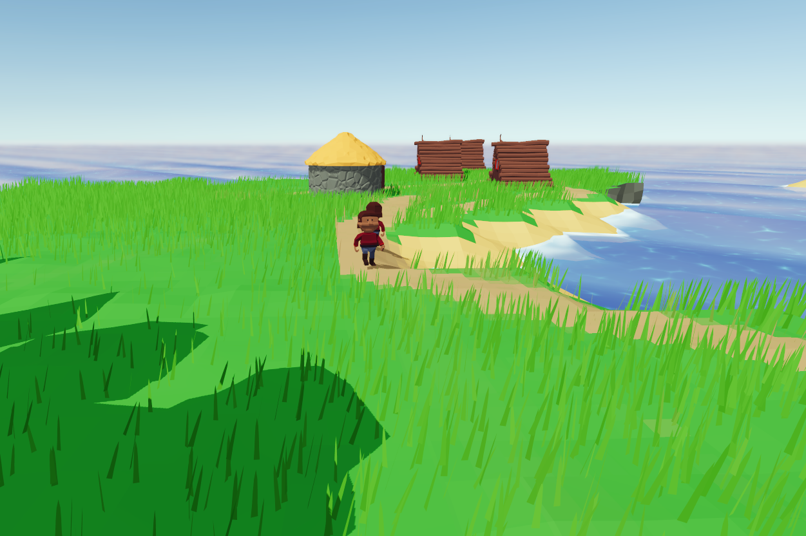
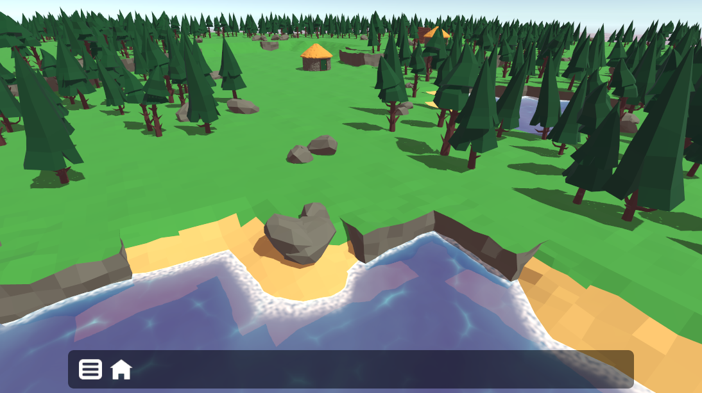
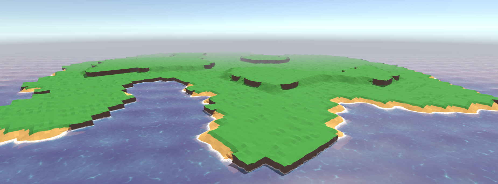
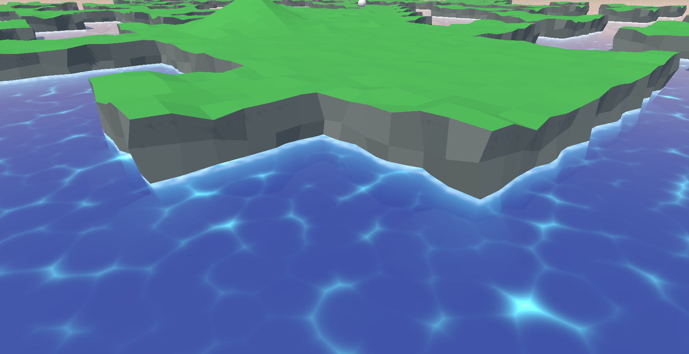

# Smolbean Ideas

I have decided I want the game to be, eventually, a cross between The Settlers and Rimworld. The aim overall will be to manage a colony of people with increasingly complex needs on a small, resource constrained island.  There won't be an "enemy" as such - in fact, the colonists are their own worst enemies - because their greed could cause them to cut down the last tree or kill the last animal for a tasty snack.  Just like real life, mankind (smolbean kind) will cause it's own downfall 99% of the time.  So resource chains and building-based production like the settlers, but I'd like the player to _care_ about their colonists, thus the Rimworld vibe.  Anyway... a long way to go...

# TO DO List
The Smolbean TODO list has been moved to Trello:  https://trello.com/b/0HaP2snl/smolbean-planet-3d

# Devlog and Screenshots

Newest entries at the top :)

## Buffy the Dodo slayer

Added a Buff system.  Rather than having a massive messy function to update animal stats each frame, each animal (including colonists) now have a list of Buffs - which control everything from aging and digestion to 
diseases and temporary effects like speed and health bonuses.

All using very standard Unity dev patterns, there are scriptable objects to define buffs in the editor and
`BuffInstance` subclasses for applying buffs at run time.

Here we can see a Dodo who has contracted "Gut Worms" (I assume from eating too much unwashed grass).  This disease buff causes increased food depletion for a given time - meaning much more food is needed to stay healthy.

## The Great User Interface Refactor

After almost a year of inactivity (I think it started when Factorio Space Age was released), I'm back with a bang.  Decided to move the UI over to a completely new theme.  Started from scratch, developed a new base stylesheet for controls, a standard format for menus, toolbars and so on.  I cleared all the local styles, altered scaling and generally made everything less complex and more stylesheet-driven.

No doubt I'll need to revamp the UI more than once in future, but with a proper set of stylesheets it should be easy.

## Charts as a form of procrastination

Spent some spare time this week getting colonists to spawn out of houses - which is a key game feature.  You can now increase your population by building more houses.

That was fun, but there was also a big chunk of debugging NavMeshAgents, annoying infinite loops and trivial details and corner cases that, this evening I decided to start playing with graphs.  So far, I have a rough sine wave and a better view of how far there is to go...

Now with added legend and gridlines...

## Work areas

Resource collection buildings, like the Woodcutter, Stonecutter, Lookout and Farm now have a designated work area, which can be selected by the player.  So you can
clear the annoying trees off the top of a mountain, or whatever you want to do.  You can also send your collectors right to the other side of the island to collect \
stuff, if you so desire.

Setting this up meant learning to build an intersection shader, which is a very cool thing indeed!

## Smoke in the wind...

After a few days break, last night I went on a coding binge and implemented global wind direction, which spins the windmill, blows smoke,
changes the sway direction for grass and trees and even influences the movement of the clouds.  It's almost certain noone would ever notice when playing!

## New production chains underway!

Been working hard on new models and behaviours for a new food production chain - from farmers, who chop _real_ grass (wearing out the ground just like Dodos and walking wear patterns) to a new windmill where a miller will turn wheat into flour
and finally on to a Baker, who will make bread from that flour.  This is just a classic production chain, as ubiquitous as `Iron Ore + Coal = Iron`, and I just had to have it!

And here's a Baker... which means the whole production chain is finished!

## Colonists! Be FREE!

Finally done it - colonists are separated from their home buildings.  This was, as I said, the last big scary bit of refactoring.  There's a new job system and some random colonists are sprinkled over the
starting map.  Much more to do, to introduce food, recreation, sleep and reproduction/population growth (I kinda like the idea that population growth is a BAD thing - the colonists get unhappy if they don't have children,
then overpopulate the island when they do...).

But first, to celebrate the colonists' newfound freedom, I'm going to implement a few new buildings and jobs for them to do.  Hunters, farmers and the Stew Keeper.  Here's the first new building, hot off the press.

24 hours later and here are three new buildings, added to the game with prefabs, specs etc.  A Hunter's Lookout, a Small House and a Barn.  Two for the new Farmer and Hunter jobs (coming soon) and
one for colonists to sleep and... erm... make more colonists as per above.

## Last big scary job

For a long time there have been changes I have needed to make that have seemed scary. The last of these is to separate colonists from buildings. This means giving them their own lifecycles,
allowing them to choose or be assigned work, and somehow combining the _many_ state machines that control them.

Anyway... this week, over many late nights, I have started!

## A weekend of UI work

Added a few new UIs, as well as some beefy optimisation of the way the game is generated, loaded and saved.

Visual highlight is the new Dodo Menu, which allows you to see some Dodo stats.

## Animal lifecycles

Animals now reproduce (there are no sexes, dodos just lay eggs), populations grow and dodos die of starvation or old age.  Dodos also like to flock together and congregate
under trees - so habitat distruction by colonists is a thing that happens now.  They eat grass to stay alive, so there's an element of selective pressure going on too.

Dodos also drop a nice juicy steak when they die - which might give a clue as to the next Colonist profession I want to add.  As might
[this tutorial on arrow trajectories](https://youtu.be/ZrZYEL4wvko?si=XyXVm7-Ot6vVJeY5).

## Animal Time!

Spent a very enjoyable Saturday sat at my desk with my newly fixed Mac, adding Dodos to Smolbean Island.

Dodos wander around eating grass, causing wear to the ground and looking silly as they don't yet have animation set up.  They have hunger and health hooked up
and will die if they don't eat for very long.

Since I want to have a couple of hundred animals roaming the island in the end, I have also had to do a bunch of optimisation.  The upshot of this is that I now
have hit 1440p 60FPS on my M1 Mac for the first time.  Check out the following screenshot full size...

## Fun with fonts

Alchemical symbols are included in the unicode spec, and contained in this free font from Google: [Noto Sans Symbols](https://fonts.google.com/noto/specimen/Noto+Sans+Symbols/glyphs).  I also added [Roboto](https://fonts.google.com/specimen/Roboto) so I could use some greek letters.

I feel like I'd rather use symbols that are universally unfamiliar than standard ones that only make sense to people of one culture or language.  I quite like the idea that the player will need to work out what the values mean.

Other cool fonts to look at:
* [Noto Sans Linear A](https://fonts.google.com/noto/specimen/Noto+Sans+Linear+A)
* [Noto Sans Linear B](https://fonts.google.com/noto/specimen/Noto+Sans+Linear+B)
* [Noto Sans Symbols 2](https://fonts.google.com/specimen/Noto+Sans+Symbols+2)
* [Noto Sans Anatolian Hieroglyphs](https://fonts.google.com/noto/specimen/Noto+Sans+Anatolian+Hieroglyphs/glyphs)
* [Noto Sans Egyptian Hyroglyphs](https://fonts.google.com/noto/specimen/Noto+Sans+Egyptian+Hieroglyphs/glyphs)
* [Noto Sans SignWriting](https://fonts.google.com/noto/specimen/Noto+Sans+SignWriting/glyphs)
* [Noto Emoji](https://fonts.google.com/noto/specimen/Noto+Emoji/glyphs)

In the end I decided to use fonts instead of bitmaps for all the icons on the game screen - and it looks GREAT.

## Niiiiice grass transitions

So the grass system GPU instances a LOT of grass blades and is probably the biggest overhead in the whole game.  To keep this under control, only batches of grass close to the camera are sent for rendering.  The issue then is that if you make the render distance short, you see nasty square edges on the edges of the batches - which means the render distance needs to stay large and GPU cost high.  

Anyway, today I realised I can do something cool with transparency on the blades of grass themselves - basicallt smoothing them to complete invisibility as they get further away.  This gives a perfect, rounded, soft edge to the grassy areas, which is much less easy to see and feels way more natural.  I can also crank down the render distance and save some power for other shaders.

These pics show the difference, with red grass to make it easier to see the difference...

## Day and Night

Added a new skybox shader, following these video tutorials for inspiration: https://www.youtube.com/@iDigvijaysinhG

Been working on a simple day and night cycle.  There's LOTS more to do to make it look good... but so far it's promising....

## Return to Wave Function Collapse

It's Christmas.  I couldn't resist returning to the WFC code and meshes.  First I added a variable number of levels - from a hard coded 3 to now a max of 7, dictated by the meshes available.  Then I added multi-level meshes which allow non-adjacent levels to join - for example, where TopLeft=1, TopRight=2, BottomLeft=3 and BottomRight=2.  This means maps with higher frequency noise can be generated, which makes things more interesting.

I also spent some time making map generation more fun at design time.

As well as some work to make mountains more realistic, with larger plains regions.

## Menu Overhaul

Unity's new UI system is a wonderful idea that's been executed very poorly - or at least not finished.  Either way, I battled it long enough to add some new menus to the game.

## Game speed

Just to make testing easier, and gameplay less boring, I added four buttons to increase game speed - 1x, 2x, 4x and 8x.

Most things just worked, others needed a `Time.deltaTime` call... and the unity NavMesh started acting weird at higher speeds.  I think one day I'm going to write my own.

## Building of buildings

The next big task is the building of buildings - which might help transform Smolbean from a demo to a game...

First step - create a building for builders to spawn at.  Since building is required right at the start, the builder's building
needs to be present when the game starts - so I have created the shipwreck, which will eventually be placed on all maps as the 
initial spawn point for colonists - containing a few resources and a handful of people.

For now, it's a building you can place, which a builder will pop out of.

## Inventory

Added a global inventory menu, showing what items are stored in buildings.  Useful for debugging if nothing else!

Also I finally found a map seed with a bridge!

## New building types

Loads of work done to create new building types, drop types and state machine based colonist behaviours - [thanks Jason Weimann](https://www.youtube.com/watch?v=V75hgcsCGOM).

The state machine behaviours are SO much more reliable than the nasty linear methods, as they allow easier branching and management of unexpected conditions (like getting lost).  The game is MUCH more playable as a result.

Here are the new Smeltery and Sawmill buildings, with the new Smelter and Sawyer professions (two new words there - only made one of them up). 

Here is a busy little town with three types of mine, a storehouse, woodcutters and a stone cutter.

Added a mine and a storehouse.  This gives me a chance to create new colonist jobs - and migrate over to proper state machines.

## World map

Added a world map, showing wear patterns, trees, rocks etc

## Smolbean Colonists

Finally managed to create and rig some very basic low poly characters to replace the original 'capsules'.  I followed [this excellent tutorial from Imphenzia](https://www.youtube.com/watch?v=PTWV67qUX2k), which explains why my characters look like very poor copies of his!  

The blender-unity workflow for animation is, frankly, a dog's dinner.  Managing animation clips in blender across 14 windows, then jumping through weird hoops to import to Unity... gah... miserable.  This is going to really put me off the whole process - but I'll force myself to stick with it I guess...

## GPU gardening

Need perlin noise that tiles?  http://kitfox.com/projects/perlinNoiseMaker/

Here's the shadergraph for the grass shader - in case it's useful to anyone.

So happy with the way grass has turned out - and still with a respectable frame rate, even on my Macbook M1.

Two millon blades of grass - but only 10FPS :)

First working GPU instanced objects (crates).  Source is this video, which is insanely short but the code works well: https://www.youtube.com/watch?v=eyaxqo9JV4w 

New graphics settings.  The depth of field on the camera (IMO) brings so much life to the scene.  Lighting slightly improved.  Held back at this stage by Unity's inability to use baked animation on prefabs... and given that every asset in the game is a prefab... this makes it a blocker.  Just means objcts look
a bit lame with not lit by the "sun" light.

## Very busy weekend

This weekend I had a very bad back, so I was basically stuck in the house, unable to do very much.  As a result though, I made HUGE progress on Smolbean Planet 3D.

Added a variety of menus and toolbars, load and save game functionality, the ability to create a new game, erm, in-game... as well as stones and a new
stonecutter's hut.

Rocks and new buildings.

A Main menu.

Creating an island, with preview, in the game.

Save and load menus, with an automated name generator (foreshadowing random names for colonists, perhaps).

Not-so-low-poly stonecutter hut.  I created the cool stone brick style of the stonecutters hut by staring blankly at this YouTube video for hours: https://www.youtube.com/watch?v=tX3JZF53e24&t=2s
UPDATE:  Then I found this two-parter: https://www.youtube.com/watch?v=19uj2bOwb3A

## Making a game

So I suddenly realised that if this is going to be a real game, I'm going to need to be able to:
1. Generate new maps at runtime
2. Save and load games
3. Generate a map with WFC very quickly
4. Add a menu system to actually do the above

This has led me onto a refactoring spree of epic proportions - with little visible change to the game!  So far, I have the WFC algorithm working 20-30 times quicker (from 40s to < 2s>) and have
separated the mesh generation, matching and data prep out into editor functions.  Hopefully this will allow me to do some saving and loading more easily - by just saving the game map and re-skinning by repeating the WFC algo with a known random seed.  No need to store mesh data, I hope...

Lots of progress on creating a god-game out of the WFC map.  I think in my head it's currently looking a lot like the original Settlers game from back in the day.  So far in reality, there's just a woodcutter's hut and a strange blue capsule who cuts down trees.  Check out the video (click through below)...

Forest Generation, using some tree prefabs I made myself, perlin noise and some random rotation, scale etc.

Added some trees and a basic woodcutter's hut.

## More tweaks to wave function collapse

It's working!  Using the Perlin noise "game map" as "bones" for an island, wave function collapse then skins it, using available tiles!

Created a quick script to create islands with Perlin noise, which will form the "game map" underneath the mesh.  Wave function collapse will be used to "skin" this map.

Getting ready to add an offset game grid - looking at grid duality stuff which Oskar Stålberg uses in Townscaper etc. See here: https://www.youtube.com/watch?v=Uxeo9c-PX-w

Maps looking stringier than ever

Funky tunnels - slowly getting better at Blender...

Tweaked the meshes for cliff-slope transitons (applied transforms, sorted normals) allowing them to be used again.  Some sussy matches between meshes to be looked at...

## Ocean

A welcome return to using shadergraph, which I really enjoy!

Beaches!!

Waves!!!!!

Added a very flat ocean, following a wonderful tutorial from here: https://alexanderameye.github.io/notes/stylized-water-shader/

## Tweaking Wave function collapse to try to build islands

I think I'm missing something here.  I can't seem to get the tile priorities set up in a way that prevents very complex coastlines.  Really I want round islands which pile upwards towards the middle.

Some hard coded tile priorities, to try to make the algorithm favour flat areas and avoid sea-like options.  Not exactly mind blowing results...

Variable island size, by setting a radius.

A nice top down view of the sea around the "island".

Added sea round the edge of the island!

Added some irregularity to make the terrain look a little less blocky - but keeping a low-poly feel for now

Fixed normals on rotated meshes using a snazzy gizmo I copy pasta'd.

## Got basic wave function collapse working

Unlike with the 2D version of this project, where I typed in the tile neighbour relationships by hand, here I load all the meshes from a single FBX file, then use a fuzzy edge matching algorithm to decide whether they are compatible as neighbours or not.  

Hacked in a very basic weighting towards flat surfaces, which gives more open areas.

Added ramps as well as cliffs.  If I'd been manually typing tile relationships, this would have taken forever - but I'm not, so it was shockingly simple!

First working wave function collapse!

Partially working algorithm which seems to create ripples.  Not working but cool :)

# References and Notes:

Here is some nice music...
https://soundimage.org/naturescience-2/

And some free sound effects
https://freesound.org/people/BurghRecords/sounds/490845/

From the undisputed master of wave function collapse:
https://www.youtube.com/watch?v=Uxeo9c-PX-w

Amazing tutorial about creating assets
https://www.youtube.com/watch?v=KFEb51rinwI&list=PLQk3p-aJsSWTKKmuFwnzEVaf3ovKIg1jx

Strategy game camera tutorial:
https://www.youtube.com/watch?v=3Y7TFN_DsoI

Download a pallete
https://lospec.com/palette-list

Use a simple colour palette in Blender
https://www.youtube.com/watch?v=8NEmx0cHwoI

Making a cliff in blender:

Adding some texture at the front:
* Add some vertical loop cuts
* Subdivide the front face
* Open the subdivide transient menu thing at the bottom left
* Along Normal = 1.0
* Play with fractal value to add noise

Aligning edges - e.g. when making a one-sided cliff, do this for left, right and bottom edges, which need to align to other tile blocks
* Select a point on the back face
* shift + s, then "Cursor to selected"
* '.' then "3d Cursor" to transform wrt 3d cursor
* 's' to scale, then 'x', 'y', or 'z' for appropriate axis
* '0' to scale to zero along that axis
* Points now nicely aligned

Lining up points with adjacent tile blocks (https://www.youtube.com/watch?v=2v7BgvUuUQU&t=907s)
Target object = the one you're going to keep.  Reference object = the one you cloned as a reference
* Clone the block and align next to itself
* Set the 3d cursor to a known-good point on the back face
* Select both objects with shift-click and go into edit mode, wireframe
* Select the point on your target object first, then the point on the reference object
* Shift s, then "Selection to active"
* Once they're all lined up, select all points along the edge of both objects and align on the axis, as per above
