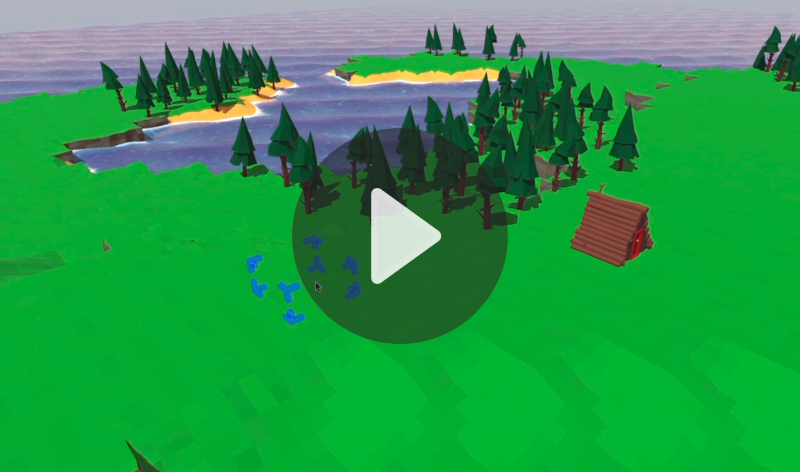

# TO DO List

* Merge all the tile meshes into a single mesh for better performance
* Remove hard coded level count and either infer it from the meshes or set it in code
* Add 2-level cliffs to allow noisier maps
* Trees, Rocks and other resources
* Add a navigation mesh for the island
* A woodcutters hut
* A woodcutter, who goes and chops down trees

# Devlog and Screenshots

Newest entries at the top :)

## Making a game

So I suddenly realised that if this is going to be a real game, I'm going to need to be able to:
1. Generate new maps at runtime
2. Save and load games
3. Generate a map with WFC very quickly
4. Add a menu system to actually do the above

This has led me onto a refactoring spree of epic proportions - with little visible change to the game!  So far, I have the WFC algorithm working 20-30 times quicker (from 40s to < 2s>) and have
separated the mesh generation, matching and data prep out into editor functions.  Hopefully this will allow me to do some saving and loading more easily - by just saving the game map and re-skinning by repeating the WFC algo with a known random seed.  No need to store mesh data, I hope...

Lots of progress on creating a god-game out of the WFC map.  I think in my head it's currently looking a lot like the original Settlers game from back in the day.  So far in reality, there's just a woodcutter's hut and a strange blue capsule who cuts down trees.  Check out the video (click through below)...

Forest Generation, using some tree prefabs I made myself, perlin noise and some random rotation, scale etc.

Added some trees and a basic woodcutter's hut.

## More tweaks to wave function collapse

It's working!  Using the Perlin noise "game map" as "bones" for an island, wave function collapse then skins it, using available tiles!

Created a quick script to create islands with Perlin noise, which will form the "game map" underneath the mesh.  Wave function collapse will be used to "skin" this map.

Getting ready to add an offset game grid - looking at grid duality stuff which Oskar Stålberg uses in Townscaper etc. See here: https://www.youtube.com/watch?v=Uxeo9c-PX-w

Maps looking stringier than ever

Funky tunnels - slowly getting better at Blender...

Tweaked the meshes for cliff-slope transitons (applied transforms, sorted normals) allowing them to be used again.  Some sussy matches between meshes to be looked at...

## Ocean

A welcome return to using shadergraph, which I really enjoy!

Beaches!!

Waves!!!!!

Added a very flat ocean, following a wonderful tutorial from here: https://alexanderameye.github.io/notes/stylized-water-shader/

## Tweaking Wave function collapse to try to build islands

I think I'm missing something here.  I can't seem to get the tile priorities set up in a way that prevents very complex coastlines.  Really I want round islands which pile upwards towards the middle.

Some hard coded tile priorities, to try to make the algorithm favour flat areas and avoid sea-like options.  Not exactly mind blowing results...

Variable island size, by setting a radius.

A nice top down view of the sea around the "island".

Added sea round the edge of the island!

Added some irregularity to make the terrain look a little less blocky - but keeping a low-poly feel for now

Fixed normals on rotated meshes using a snazzy gizmo I copy pasta'd.

## Got basic wave function collapse working

Unlike with the 2D version of this project, where I typed in the tile neighbour relationships by hand, here I load all the meshes from a single FBX file, then use a fuzzy edge matching algorithm to decide whether they are compatible as neighbours or not.  

Hacked in a very basic weighting towards flat surfaces, which gives more open areas.

Added ramps as well as cliffs.  If I'd been manually typing tile relationships, this would have taken forever - but I'm not, so it was shockingly simple!

First working wave function collapse!

Partially working algorithm which seems to create ripples.  Not working but cool :)

# References and Notes:

From the undisputed master of wave function collapse:
https://www.youtube.com/watch?v=Uxeo9c-PX-w

Amazing tutorial about creating assets
https://www.youtube.com/watch?v=KFEb51rinwI&list=PLQk3p-aJsSWTKKmuFwnzEVaf3ovKIg1jx

Strategy game camera tutorial:
https://www.youtube.com/watch?v=3Y7TFN_DsoI

Download a pallete
https://lospec.com/palette-list

Use a simple colour palette in Blender
https://www.youtube.com/watch?v=8NEmx0cHwoI

Making a cliff in blender:

Adding some texture at the front:
* Add some vertical loop cuts
* Subdivide the front face
* Open the subdivide transient menu thing at the bottom left
* Along Normal = 1.0
* Play with fractal value to add noise

Aligning edges - e.g. when making a one-sided cliff, do this for left, right and bottom edges, which need to align to other tile blocks
* Select a point on the back face
* shift + s, then "Cursor to selected"
* '.' then "3d Cursor" to transform wrt 3d cursor
* 's' to scale, then 'x', 'y', or 'z' for appropriate axis
* '0' to scale to zero along that axis
* Points now nicely aligned

Lining up points with adjacent tile blocks (https://www.youtube.com/watch?v=2v7BgvUuUQU&t=907s)
Target object = the one you're going to keep.  Reference object = the one you cloned as a reference
* Clone the block and align next to itself
* Set the 3d cursor to a known-good point on the back face
* Select both objects with shift-click and go into edit mode, wireframe
* Select the point on your target object first, then the point on the reference object
* Shift s, then "Selection to active"
* Once they're all lined up, select all points along the edge of both objects and align on the axis, as per above
